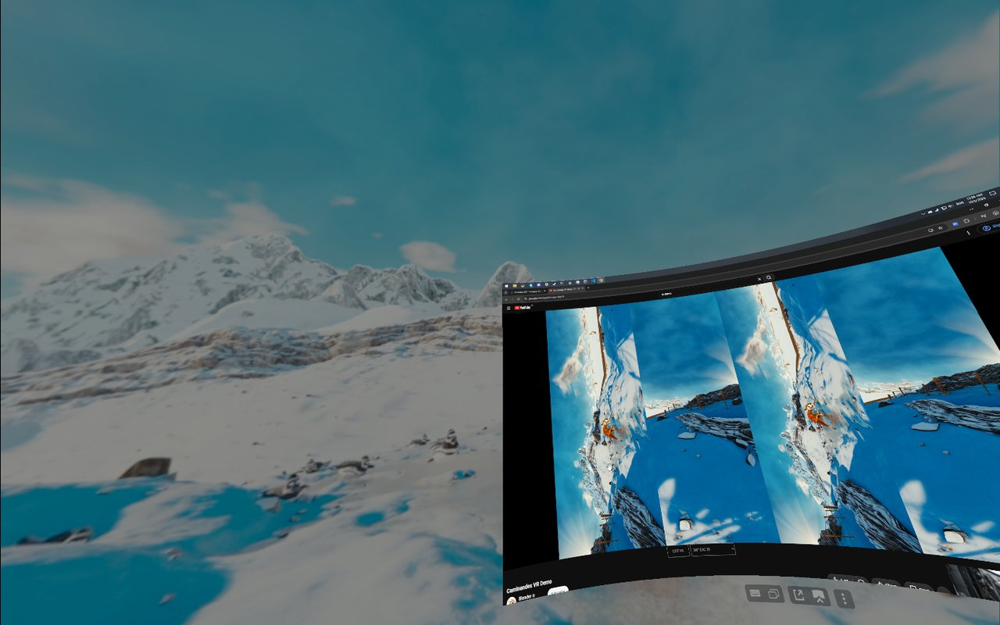
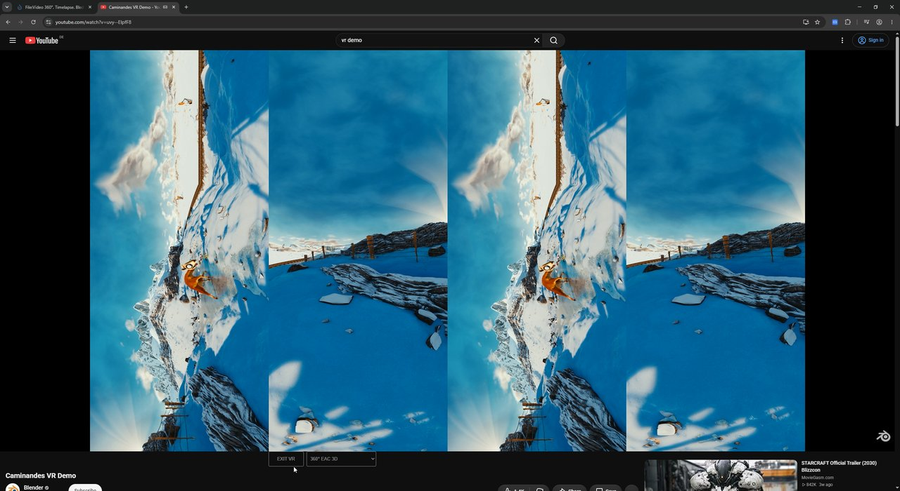
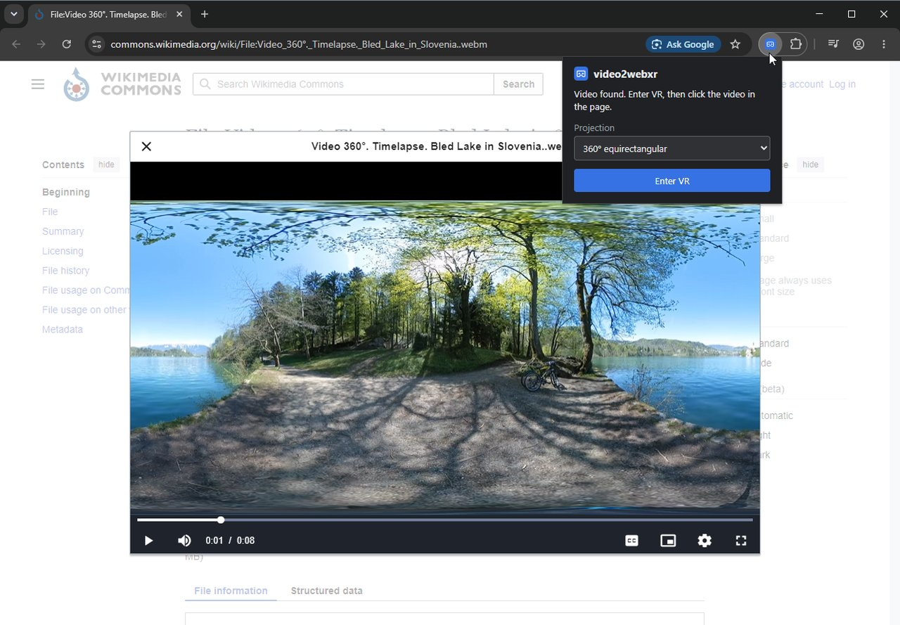

# video2webxr

A Chromium extension that plays web videos in your PC VR headset through WebXR, using https://threejs.org/

- **YouTube:** 360°, VR180 and 3D videos, via a cardboard icon in the player
- **Other sites:** any non-DRM video, via the extension's toolbar button



### Install
1. Install a Chromium based browser - Chrome, Edge, Brave etc.
2. Download `video2webxr-<version>.zip` from the [latest release](https://github.com/phit/video2webxr/releases/latest) and unzip it to a folder
3. Open the extensions page in the browser and enable developer mode
4. Click "Load Unpacked" and choose the folder

### Usage
1. Turn VR on first (e.g. start SteamVR)
2. Start a new browser so that it detects the hardware

**On YouTube**
1. Open a 360° or VR180 video, e.g. on https://www.youtube.com/vr/
2. Click on the white cardboard icon in the bottom right hand corner of the video
3. Pick the video's projection in the dropdown next to the "Enter VR" button
4. Click on the "Enter VR" button below the video

   

**On other sites**
1. Start playing the video
2. Click the video2webxr button in the browser toolbar (pin it from the extensions menu)
3. Pick the projection in the popup (defaults to 180° 3D side by side; your choice is remembered) and click "Enter VR"
4. Click the video in the page to enter VR. Browsers only start VR from a click in the page itself, so this step can't be skipped
5. Open the popup again to change the projection while in VR, or click "Stop"

   

The page itself gets no extra controls, so video lightboxes and overlays keep working.

### Projections

| Projection | Use it for |
|---|---|
| 360° EAC (YouTube default) | 360° videos on YouTube - this is how YouTube serves them on desktop |
| 360° EAC 3D | 3D 360° videos served as stereo EAC |
| 360° cubemap | videos in a plain 3x2 cubemap layout |
| 360° equirectangular | 360° videos served as a single equirectangular image (2:1) |
| 360° 3D top/bottom, side by side | 3D equirectangular 360° videos |
| 180° | VR180 videos on YouTube, and other mono 180° videos |
| 180° 3D side by side (other sites' default) | 3D 180° videos with both eyes side by side, the most common VR video format |
| Flat screen | normal videos, shown on a virtual screen in front of you |

You can switch the projection while in VR. If the image looks jumbled into squares, try a 360° EAC option; if it looks stretched or doubled, try the others.

### Limitations
- DRM-protected videos (Netflix, Prime Video, Disney+ etc.) can't be shown: the browser won't hand protected frames to WebGL
- Videos served from another domain without CORS headers can't be read by WebGL either; the extension retries with CORS turned on and tells you if that doesn't work
- On other sites the toolbar button can only reach videos in the page itself and in same-site frames
- The Steam Frame's built-in browser doesn't work with it yet; see [saphid/chromium-webxr-steam-frame](https://github.com/saphid/chromium-webxr-steam-frame) for a community workaround

### Troubleshooting
If "Enter VR" says "VR NOT SUPPORTED", the browser hasn't found your headset:
- Make sure SteamVR is running and the headset is connected
- Set "WebXR runtime" to OpenXR at `chrome://flags/#webxr-runtime` and restart the browser

If clicking the video doesn't enter VR, close other browser windows that use the headset; only one browser can be in VR at a time. The popup shows why the last attempt failed.

If you don't see the white cardboard icon in the bottom right hand corner of a YouTube video then the extension is not installed or disabled

### Development
Sources are in `src/`: `youtube.js` (YouTube integration), `generic.js` (toolbar button on other sites), `vr-player.js` (the shared WebXR player) and `background.js` (the service worker).

```
npm install
npm run build   # builds the extension into dist/
npm run watch   # unminified with source maps, rebuilt on change
```
Load `dist/` unpacked in the browser. `npm run check` lints and checks formatting with [Biome](https://biomejs.dev/), and `npm run fix` applies fixes; CI fails on either.

Commit messages follow [Conventional Commits](https://www.conventionalcommits.org): `feat:`, `fix:`, `perf:`, `refactor:`, `docs:`, `build:`, `ci:`, `style:`, `chore:`, `test:`, optionally with a scope (`feat(youtube): ...`). Release notes are generated from them with [git-cliff](https://git-cliff.org); `npm run changelog` previews the notes for unreleased commits.

### Releasing
Bump `version` in `manifest.json` and `package.json`, commit (`chore: release 2.1.0`), then push a matching tag: `git tag v2.1.0 && git push origin v2.1.0`. GitHub Actions builds the zip and publishes the release with the generated notes.

### Credits
- Based on [EnableYoutubePCVR](https://github.com/feedthedogs/EnableYoutubePCVR) by feedthedogs (ISC)
- Cardboard icon from [Tabler Icons](https://tabler.io/icons) (MIT)
- Rendering by [three.js](https://threejs.org/) (MIT)
